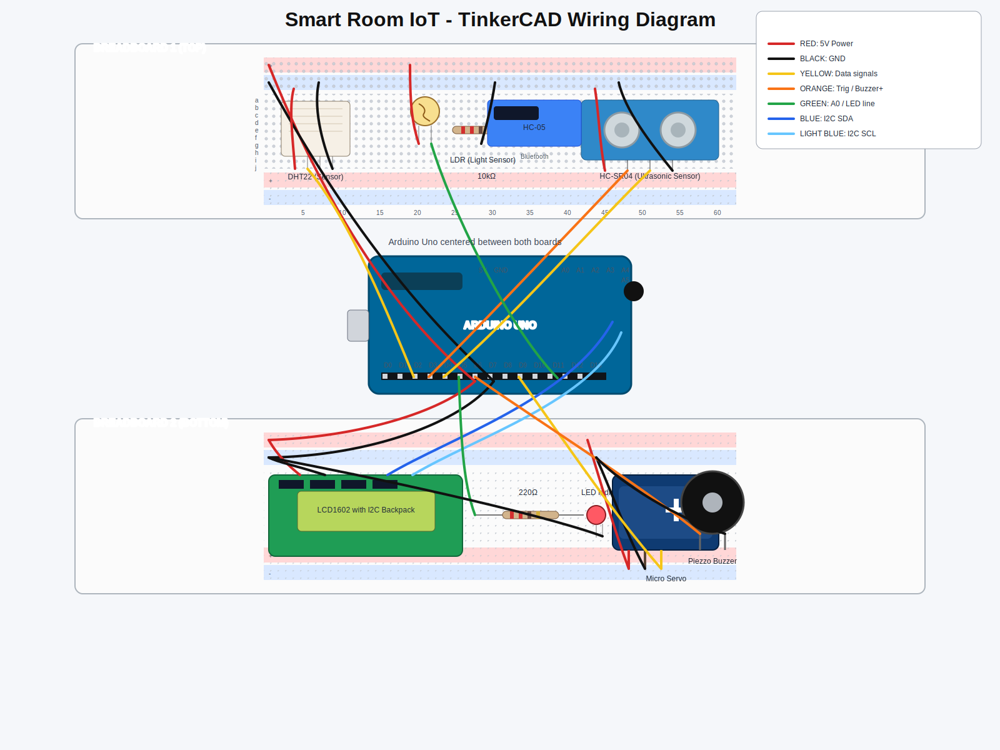

# Smart Room IoT

Smart Room Monitoring & Control system using Arduino Uno sensors/actuators, Raspberry Pi gateway processing, and a Flask dashboard.

## Project overview
This repository contains architecture and wiring documentation for a two-breadboard Smart Room IoT prototype. The wiring layout is designed for clear power polarity, clean signal routing, and maintainable subsystem separation.

## System architecture
- **Device layer (Arduino Uno)**: DHT22, LDR, HC-SR04 inputs + Servo, LED, Buzzer outputs + LCD1602 local display + HC-05 communication.
- **Gateway layer (Raspberry Pi)**: receives JSON via Bluetooth/Serial and stores telemetry in SQLite.
- **Application layer (Flask)**: visualizes historical data and sends control commands.

## Circuit diagram
- Realistic SVG diagram: [`circuit-diagram/tinkercad-realistic-wiring.svg`](./circuit-diagram/tinkercad-realistic-wiring.svg)
- Wiring documentation: [`circuit-diagram/README.md`](./circuit-diagram/README.md)
- Pin-by-pin wiring table: [`circuit-diagram/connections-table.md`](./circuit-diagram/connections-table.md)
- Step-by-step wiring guide: [`docs/WIRING_GUIDE.md`](./docs/WIRING_GUIDE.md)

## Getting started
1. Open the realistic SVG wiring diagram and verify each connection.
2. Assemble hardware by following `docs/WIRING_GUIDE.md` from power rails first, then signal lines.
3. Confirm continuity and polarity before powering the circuit.
4. Upload Arduino firmware and validate sensor/actuator behavior incrementally.
